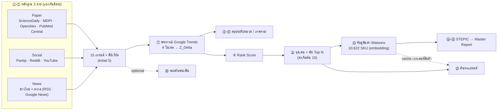

<div align="center">

# Trend Pipeline v2

**ไปป์ไลน์วิเคราะห์และพยากรณ์เทรนด์ความงามและของใช้ส่วนตัว**
เก็บหลักฐานจาก 3 สาย → พยากรณ์ด้วย Google Trends จริง → จับคู่กับสินค้าในตลาด → รายงานฉบับสมบูรณ์


-orange)


🧭 [ภาพรวม](#-ภาพรวม) | ⚙️ [ติดตั้ง](#️-ติดตั้ง) | ▶️ [การใช้งาน](#️-การใช้งาน) | 🐍 [ใช้เป็นไลบรารี](#-ใช้เป็นไลบรารี) | 💾 [ผลลัพธ์และการกู้คืน](#-ผลลัพธ์และการกู้คืน) | 🔁 [ความคลาดเคลื่อน](#-ความคลาดเคลื่อนและข้อจำกัด) | 🛠️ [การพัฒนาต่อ](#️-การพัฒนาต่อ)

</div>

---

## 📰 อัปเดตล่าสุด

- **2026-09-22** — โค้ดทั้งหมดที่ใช้อยู่ใน repo นี้แล้ว ส่วนที่ใช้จริงของ `trend_final.py` / `trend_final_v2.py`
  (ระบบรุ่นแรก ไม่อยู่ใน repo) คัดลอกตรงตัวไว้ใน `tool/common/` พร้อมเทสต์เทียบต้นฉบับ
- **2026-09-16** — คัด **Top N** (ค่าเริ่มต้น 10) ด้วย Rank Score หลังพยากรณ์ ⑪ แยกเทรนด์ "สินค้า" กับ "ช่องทาง/พฤติกรรมการซื้อ"
  รายงานเรียงตามความสนใจปีปัจจุบัน และเพิ่ม `Plot_bump_chart.py`
- **2026-09-15** — ย้าย LLM ทั้งระบบไป **AWS Bedrock** (GLM-5 หลัก / Mistral Large 3 สำรอง) เพิ่มเมนู 2 โหมด
  และสกัด triplet ทีละเอกสารพร้อมประโยคหลักฐาน

<details>
<summary>ก่อนหน้านั้น</summary>

- **2026-09-12** — แยกผลลัพธ์เป็นรอบ (`output/<run_id>/`) พร้อม `_manifest.json`, จัดกลุ่มแบบ consensus 20 รอบ,
  Longevity ยืนยันข้ามสาย
- **2026-09-11** — ขั้น ①-⑮ ครบด้วยข้อมูลจริงทุกขั้น และจัดโครงสร้างเป็น `main.py` + `tool/` + `output/`

</details>

> [!NOTE]
> ผลของระบบเป็น **เครื่องมือช่วยตัดสินใจ** ไม่ใช่คำตอบสุดท้าย ส่วนที่ใช้ LLM ให้ผลต่างกันได้ในแต่ละรอบ และการจับคู่สินค้า
> ยังไม่เคยวัดความแม่นเทียบกับป้ายที่คนตรวจ — ดู [ความคลาดเคลื่อนและข้อจำกัด](#-ความคลาดเคลื่อนและข้อจำกัด)

---

## 🧭 ภาพรวม

ระบบทำงานคล้ายทีมวิจัยตลาด: แยกทีมเก็บหลักฐาน 3 สายที่ไม่ปนกัน ให้แต่ละสายสรุปเทรนด์ของตัวเอง แล้วค่อยรวมกันที่ชั้นพยากรณ์
คัดเทรนด์ที่กำลังโต ดูว่าตลาดมีสินค้ารองรับหรือยัง และสรุปเป็นรายงาน — **ตัวเลขตัดสินด้วยกฎตายตัว ส่วน LLM ทำงานด้านภาษา**



### สายหลักฐาน (①-⑤)

ทั้ง 3 สายใช้โครงเดียวกัน ต่างกันแค่แหล่งข้อมูลและภาษาที่ใช้ค้น จึงเทียบกันได้ตรงๆ

| สาย | แหล่งข้อมูล | ตอบคำถาม |
|---|---|---|
| **Paper** | ScienceDaily, MDPI, OpenAlex, PubMed Central | กลไกและเทคโนโลยีอะไรกำลังมา |
| **Social** | Pantip, Reddit, YouTube | ผู้บริโภคเจอปัญหาอะไร พูดถึงอะไร |
| **News** | ข่าวไทย + ข่าวสากล (RSS ใน `config/rss_feeds.json` + Google News) | ตลาด/แบรนด์/กฎเกณฑ์ขยับไปทางไหน |

ขั้นตอนในแต่ละสาย: LLM สร้างคำค้น → รวบรวมบทความ → LLM เลือกชิ้นที่เกี่ยวข้อง → เขียนรายงานพร้อมอ้างอิง `(Ref N)` →
สกัด triplet ทีละเอกสาร **พร้อมประโยคหลักฐานที่โค้ดตรวจว่ามีอยู่จริง** → สร้างกราฟและจัดกลุ่ม (Louvain โหวต 20 รอบ) →
ตั้งชื่อเทรนด์ + ให้คะแนน Longevity → แตกคีย์เวิร์ดสำหรับค้น Google Trends — เก็บ 5 เทรนด์ต่อสาย

### ชั้นพยากรณ์และจัดอันดับ (⑦ ⑧-⑨ ⑥)

- **⑦ พยากรณ์** — ดึง Google Trends ทั่วโลกผ่าน SerpAPI แปลงเป็น z-score รายเดือน พยากรณ์ด้วย 4 โมเดล
  (Holt-Winters, Linear Regression, Random Forest, XGBoost) เลือกโมเดลจากความคลาดเคลื่อนบนช่วง holdout 6 เดือน
  แล้วคำนวณ **Z_Delta** = ค่าเฉลี่ยที่พยากรณ์ − ค่าปัจจุบัน สถานะตั้งด้วยเกณฑ์ตายตัว
  (> 0.8 Major Breakout, > 0.2 Rising, < −0.2 Fading, นอกนั้น Stable)
- **⑧-⑨ สรุประดับหมวด** — รวม Z_Delta เป็นภาพรวมต่อสายและทั้งหมด (เป็นผลสรุป ไม่มีขั้นอื่นอ่านต่อ)
- **⑥ Rank Score** — `Z_Delta × (1 + 0.1 × (จำนวนสายที่เจอคีย์เวิร์ด − 1))` ถ้า Z_Delta > 0 (ถ้าไม่ใช้ Z_Delta ตรงๆ)
  และปรับคะแนน Longevity ของเทรนด์ที่ยืนยันข้ามสาย — **รันหลัง ⑦ เพราะต้องใช้ Z_Delta**

### ชั้นอุปทาน (⑪ ⑫ ⑬)

- **⑪ จุดเด่น + Top N** — เดินตามอันดับ ⑥ ให้ LLM สกัดจุดเด่น (Means-End Chain / JTBD) และจัดประเภทเทรนด์
  ข้ามเทรนด์ประเภทช่องทาง/พฤติกรรมการซื้อ หรือที่ไม่มีข้อความให้จับคู่ แล้วเลื่อนอันดับถัดไปขึ้นมาจนครบ N
  ชุดนี้คือ Top N ชุดเดียวที่ ⑫ ⑬ รายงาน และ bump chart ใช้ร่วมกัน
- **⑫ จับคู่สินค้า** — แปลงจุดเด่นเทรนด์ (`query`) และข้อมูลสินค้า Watsons 10,622 SKU (`passage`) เป็นเวกเตอร์ 2,048 มิติ
  เรียงด้วย cosine similarity เก็บ 15 อันดับแรกต่อเทรนด์ และให้ LLM เขียนเหตุผลสั้นๆ ให้ 5 อันดับแรก
- **⑬ ค้นหาแบรนด์** — ดูว่าสินค้าของแบรนด์ที่ระบุอยู่ตรงไหนของแต่ละเทรนด์ (Top 5 ต่อเทรนด์)

### รายงาน (⑭-⑮)

วิเคราะห์แรงขับ 6 ด้าน (STEPIC: Society, Technology, Environment, Policy, Industry, Creativity) สังเคราะห์รวม
แล้วประกอบเป็น Master Report ที่มีรายงาน 3 สาย ผลพยากรณ์ จุดเด่นเทรนด์ และสินค้าที่จับคู่ได้ เรียงตามอันดับความสนใจปีปัจจุบัน

### โมเดลที่ใช้

| งาน | โมเดล |
|---|---|
| งานภาษาทั้งหมด (คำค้น, รายงาน, triplet, ตั้งชื่อ, จุดเด่น, STEPIC) | `zai.glm-5` บน AWS Bedrock — สำรองอัตโนมัติด้วย `mistral.mistral-large-3-675b-instruct` |
| เหตุผลจับคู่สินค้า (⑫ ⑬) | `amazon.nova-lite-v1:0` บน AWS Bedrock |
| เวกเตอร์ข้อความ (⑫ ⑬) | `nvidia/llama-nemotron-embed-vl-1b-v2` ผ่าน NVIDIA NIM |

การสลับโมเดลทำที่จุดเดียวคือ `use_bedrock()` ใน `common/bootstrap.py` ถ้าตอบ JSON ไม่ได้จะเรียกซ้ำ 1 ครั้ง แล้วสลับไปตัวสำรอง
และบันทึกโมเดลที่ใช้จริงลง `_manifest.json` ของรอบ

---

## ⚙️ ติดตั้ง

ทุกคำสั่งรันจากโฟลเดอร์บนสุดของ repo (ทดสอบกับ Python 3.14)

```powershell
git clone https://github.com/keingkrai/Trend_analysis.git
cd Trend_analysis
python -m venv .venv                 # .venv ไม่ถูก commit (อยู่ใน .gitignore)
.venv\Scripts\Activate.ps1
pip install -r requirements.txt
```

### คีย์ API

สร้างไฟล์ `.env` ที่โฟลเดอร์บนสุดของ repo แล้ววางคีย์ตามตาราง (ไฟล์นี้ไม่ถูก commit)

| ตัวแปร | ใช้ที่ | จำเป็น |
|---|---|---|
| `AWS_BEARER_TOKEN_BEDROCK` (หรือ `AWS_ACCESS_KEY_ID` + `AWS_SECRET_ACCESS_KEY`) | LLM ทุกขั้น | ✅ |
| `AWS_REGION` | LLM (ค่าเริ่มต้น `us-east-1`) | – |
| `SERPAPI_KEY` | ⑦ ⑩ Google Trends (เสียโควตา) | ✅ |
| `NVIDIA_API` | ⑫ ⑬ embedding | ✅ |
| `OPENROUTER_API_KEY`, `GEMINI_KEY` | ไม่ได้เรียกใช้แล้ว แต่โค้ดสร้าง client ตอน import — **ต้องมีค่าที่ไม่ว่าง** | ✅ |
| `YOUTUBE_API_KEY`, `REDDIT_CLIENT_ID`, `REDDIT_CLIENT_SECRET` | สาย Social | สำหรับสาย Social |
| `APIFY_API_KEY` | ดึงหน้าเว็บที่บล็อกการ scrape ตรงๆ | แนะนำ |
| `OPEN_ALEX_KEY` | สาย Paper (ไม่มี = ข้าม OpenAlex) | – |
| `NCBI_API_KEY`, `NCBI_EMAIL` | สาย Paper / PubMed Central (ไม่มี = ช้าลง) | – |

---

## ▶️ การใช้งาน

### รันแบบโต้ตอบ

```powershell
python main.py
```

เลือกโหมดตอนเริ่ม:

1. **รันเทรนด์ทั้งชุด** — ถามหัวข้อ, จำนวนปีที่พยากรณ์, จำนวน Top N แล้วรันทุกขั้นตามลำดับ จบแล้วถามว่าจะรัน ⑩ ไหม
   และถามชื่อแบรนด์สำหรับ ⑬ ได้หลายแบรนด์ต่อเนื่อง
2. **ค้นหาแบรนด์ในเทรนด์** — เลือกรอบที่มีอยู่แล้ว แล้วรันเฉพาะ ⑬ ไม่ต้องรันเทรนด์ใหม่

### รันแบบไม่โต้ตอบ

ใส่ `--topic` จะข้ามเมนูไปโหมด 1 ทันที

```powershell
python main.py --topic "beauty and personal care" --years 3 --top-n 10 --skip-discovery --skip-brand
```

| ตัวเลือก | ความหมาย |
|---|---|
| `--topic` | หัวข้อเทรนด์ |
| `--years` | จำนวนปีที่พยากรณ์ (คูณ 12 เป็นเดือน) |
| `--top-n` | จำนวนเทรนด์ที่ใช้ต่อหลังพยากรณ์ (ค่าเริ่มต้น 10) |
| `--skip-discovery` | ไม่ถามและไม่รัน ⑩ |
| `--skip-brand` | ไม่ถามและไม่รัน ⑬ |

### ลำดับที่รันจริง

ขั้นที่ **จำเป็น** ถ้าพังไปป์ไลน์หยุดทันที ขั้นที่ไม่จำเป็นพังแล้วไปต่อได้ — 🤖 = เรียก LLM, 💸 = เสียโควตา SerpAPI

| ลำดับ | ขั้น | สคริปต์ (ต่อจาก `tool/`) | ผลลัพธ์ในโฟลเดอร์รอบ |
|---|---|---|---|
| 1-3 | ①-⑤ Paper / Social / News 🤖 | `phase1_paper_stream/paper_stream.py`<br/>`phase2_three_streams/social/social_stream.py`<br/>`phase2_three_streams/news/news_stream.py` | `phase1_paper_stream_result.json`<br/>`phase2_social_stream_result.json`<br/>`phase2_news_stream_result.json` |
| 4 | ตรวจว่า 3 สายต่างกันจริง (ไม่จำเป็น) | `phase2_three_streams/compare_all_streams.py` | `phase2_all_streams_comparison.json` |
| 5 | ⑦ พยากรณ์ 🤖💸 | `phase2_three_streams/fetch_trends_worldwide_serpapi.py` | `phase2_paper_social_z_delta_result.json`, `serpapi_forecast_run/step5a-5c_*.xlsx` |
| 6 | ⑧-⑨ สรุประดับหมวด | `phase2_three_streams/run_category_aggregation.py` | `phase2_category_overall_result.json` |
| 7 | ⑥ Rank Score | `phase2_three_streams/rank_trends.py` | `phase2_rank_score_final_mode_result.json`, `phase2_longevity_cross_source_result.json` |
| 8 | ⑪ จุดเด่น + Top N 🤖 | `phase3_supply_layer/extract_trend_highlights.py` | `phase3_trend_highlights_result.json`, `serpapi_forecast_run/step5c_df_cluster_forecast_top{N}.xlsx` |
| 9 | ⑫ จับคู่สินค้า 🤖 | `phase3_supply_layer/validate_at_scale_nvidia.py` | `phase3_scale_validation_nvidia_result.json` |
| 10 | ⑭-⑮ รายงาน 🤖 | `phase5_report/run_stepic_report.py` | `phase4_master_trend_report.md`, `phase4_stepic_*.json` |
| (ถาม) | ⑩ รอบค้นพบเพิ่ม 🤖💸 | `phase2_three_streams/cross_category_discovery.py` | `phase2_cross_category_discovery_result.json` |
| (ถาม) | ⑬ ค้นหาแบรนด์ 🤖 | `phase3_supply_layer/run_brand_coverage.py` | `phase3_brand_coverage_<แบรนด์>.json` / `.xlsx` และต่อท้ายหัวข้อแบรนด์ใน `phase4_master_trend_report.md` |

### Bump chart

```powershell
python Plot_bump_chart.py                                              # ถามว่าจะใช้รอบไหน (Enter = ล่าสุด)
python Plot_bump_chart.py --run beauty_and_personal_care_20260916_082438
```

บันทึก `trend_bump_chart.png` และ `step5c_df_cluster_forecast_ranks_<เวลา>.xlsx` ไว้ในโฟลเดอร์รอบนั้น

---

## 🐍 ใช้เป็นไลบรารี

ทุกสคริปต์โหลดค่าร่วมจาก `common/bootstrap.py` — เพิ่ม `tool/` เข้า `sys.path` แล้ว import ได้เลย
ถ้าจะทำงานกับรอบที่มีอยู่ ให้ตั้ง `TREND_RUN_ID` **ก่อน** import

```python
import os, sys
os.environ["TREND_RUN_ID"] = "beauty_and_personal_care_20260916_082438"
sys.path.insert(0, "tool")

from common.bootstrap import OUTPUTS, load_ranked_trends
ranked = load_ranked_trends()   # ทุกเทรนด์ตามอันดับ ⑥
# [{'overall_rank': 1, 'stream': 'News', 'trend': 'Pregnancy-Safe Dermocosmetics', 'rank_score': 1.08, ...}, ...]
```

`load_ranked_trends()` / `select_top_trends(n)` ให้อันดับจาก Rank Score อย่างเดียว ชุด Top N ที่ใช้จริงหลัง ⑪ คัดประเภทแล้ว
อยู่ใน `phase3_trend_highlights_result.json` คีย์ `selected_trends` (`overall_rank` = อันดับจาก ⑥, `top_rank` = 1..N)

### เรียก LLM

```python
from common.bootstrap import tf, use_bedrock

with use_bedrock():                                   # GLM-5 + สำรองอัตโนมัติ
    resp = tf.client.chat.completions.create(
        model=tf.MODEL_NAME_META,
        messages=[{"role": "user", "content": "Reply with exactly: OK"}],
        max_tokens=20,
    )
print(resp.choices[0].message.content)
```

`use_bedrock(model_id="amazon.nova-lite-v1:0")` เปลี่ยนโมเดลเฉพาะจุด ส่วนฟังก์ชันของ v2 (`tf2`) มี client แยก ต้องส่ง
`module=tf2`

### พยากรณ์ด้วยข้อมูลรายเดือนของตัวเอง

ไม่ยิง SerpAPI — ส่ง DataFrame คอลัมน์ `Keyword`, `start_date`, `search_avg` เข้า `monthly_df_override`

```python
from common import trend_final_v2_subset as tf2
from common.bootstrap import use_bedrock

with use_bedrock(module=tf2):
    keywords, df_forecast, master_report, llm_analysis = tf2.forecast_trend(
        "my_forecast_dir", {"Barrier Repair": ["ceramide", "barrier cream"]}, "Global Beauty",
        monthly_df_override=monthly_df, horizon=36,
    )
```

### Embedding สินค้า

```python
sys.path.insert(0, "tool/phase3_supply_layer")
import pandas as pd
from validate_at_scale_nvidia import TOOL_DIR, embed_all_products, load_checkpoint, get_embedding

df = pd.read_csv(TOOL_DIR / "product" / "watsons_product.csv", low_memory=False)
vectors = embed_all_products(df)          # embed เฉพาะแถวที่ยังไม่มีใน cache แล้วคืน {แถว: เวกเตอร์ 2,048 มิติ}
cached = load_checkpoint(df)              # อ่าน cache อย่างเดียว ไม่เรียก API (แถวที่ยังไม่มีได้ None)
vec = get_embedding("ครีมกันแดดไม่มีน้ำหอม", "query")   # สินค้าใช้ "passage" เทรนด์ใช้ "query"
```

---

## 💾 ผลลัพธ์และการกู้คืน

### โฟลเดอร์รอบ

แต่ละครั้งที่รัน `main.py` ผลลงที่ `output/<หัวข้อ>_<วันเวลา>/` ไม่เขียนทับรอบก่อน และมี `_manifest.json`
บันทึก hash ของไฟล์ input/output, โมเดลที่ใช้จริง และเวลาของแต่ละขั้น — ตอบได้ว่ารายงานฉบับหนึ่งมาจากข้อมูลชุดไหน

### รันต่อจากขั้นที่พัง

ทุกขั้นเป็นสคริปต์แยก เมื่อขั้นไหนพัง `main.py` จะพิมพ์คำสั่งซ่อมให้ ตั้งค่ารอบเดิมแล้วรันเฉพาะขั้นนั้นจากโฟลเดอร์บนสุดของ repo

```powershell
$env:TREND_RUN_ID="beauty_and_personal_care_20260916_082438"; $env:TREND_TOPIC="beauty and personal care"; $env:TREND_YEARS="3"; $env:TREND_TOP_N="10"; python tool/phase3_supply_layer/extract_trend_highlights.py
```

ถ้ารันสคริปต์ตรงๆ โดยไม่ตั้ง `TREND_RUN_ID` ผลจะลงโฟลเดอร์ `adhoc_<เวลา>` (โฟลเดอร์ที่ว่างจะลบตัวเองตอนจบ)

### Cache ที่ใช้ข้ามรอบ

| ไฟล์ | เก็บอะไร | ถ้าลบ |
|---|---|---|
| `output/_checkpoints/phase3_product_embeddings_checkpoint_nvidia.pkl` | เวกเตอร์สินค้า อ้างอิงด้วย hash ของข้อความสินค้า | ⑫ embed ใหม่ทั้งหมด และ ⑬ ใช้ไม่ได้จนกว่า ⑫ จะรันจบ |
| `memory/scraped_cache.json` (ในโฟลเดอร์ที่สั่งรัน ปกติคือ `memory/` ที่โฟลเดอร์บนสุด) | บทความที่ดึงมาแล้ว | ดึงเว็บใหม่ ช้าลง |

---

## 🔁 ความคลาดเคลื่อนและข้อจำกัด

- **LLM ให้ผลต่างกันได้ในแต่ละรอบ** — ชื่อเทรนด์และคีย์เวิร์ดอาจไม่เหมือนเดิมแม้ใช้หัวข้อเดิม ลดผลนี้ด้วย `temperature=0`
  ในขั้นสกัด triplet และตั้งชื่อคลัสเตอร์ และจัดกลุ่มด้วยการโหวต Louvain 20 รอบ
- **ตัวเลขใช้กฎตายตัว** — สถานะเทรนด์, investment signal, Rank Score, Longevity และการคัด Top N คำนวณจากข้อมูลดิบ
  เพราะ walk-forward validation (n=186) พบว่ากฎจาก Z_Delta แม่น 63.4% ขณะที่ LLM ตัดสินเองแม่น 40.9%
- **การพยากรณ์ทำซ้ำได้** — ข้อมูลรายเดือนชุดเดิมให้ผลเดิม (รันซ้ำด้วยข้อมูลที่เก็บไว้ของรอบ 082438 ได้ `step5c` ตรงทุกค่า)
  แต่ถ้าดึง Google Trends ใหม่ ตัวเลขจะเปลี่ยนตามข้อมูลล่าสุด
- **การจับคู่สินค้ายังไม่เคยวัดความแม่นเทียบกับคน** — จับได้ดีกับเทรนด์ที่เป็นหมวดสินค้าชัด (เช่น กันแดด, ดูแลเส้นผม)
  แต่อ่อนกับเทรนด์เชิงเทคโนโลยีสูตรหรือเทรนด์ที่นิยามจากกลุ่มผู้ใช้ และค่า similarity ยังไม่มีเกณฑ์ตัดสิน —
  ใช้ผลเป็นรายชื่อตัวเลือกให้คนตรวจต่อ

---

## 🛠️ การพัฒนาต่อ

- **ใช้ `common/bootstrap.py` หา path เสมอ** (`PROJECT_ROOT` = โฟลเดอร์บนสุดของ repo, `TOOL_DIR`, `OUTPUTS`, `CHECKPOINTS`) — ห้ามเขียน path ตายตัว
- **ผลเฉพาะรอบเขียนลง `OUTPUTS`** ส่วน cache ที่ไม่ขึ้นกับหัวข้อเขียนลง `CHECKPOINTS` (ถ้าใช้ `OUTPUTS` จะถูกสร้างใหม่ทุกรอบ)
- **ใช้ `safe_json_parse` จาก `common.bootstrap`** เมื่อ parse คำตอบของ LLM
- **เพิ่มขั้นใหม่** — ใส่ใน `STAGES` ของ `main.py` และลงไฟล์ input/output ใน `STAGE_IO_MAP` ของ `bootstrap.py` เพื่อให้ manifest ครบ
- **`common/trend_final_subset.py` / `trend_final_v2_subset.py`** เป็นสำเนาตรงตัวของต้นฉบับ ทุกบล็อกมีป้ายบรรทัดต้นฉบับ
  ถ้าจะแก้บล็อกไหน ให้ใส่ `⚠️ แก้จากต้นฉบับ: <เหตุผล>` ในป้าย ไม่อย่างนั้นเทสต์จะฟ้อง (ต้นฉบับไม่อยู่ใน repo —
  เทสต์ที่ต้องเทียบกับต้นฉบับจะข้ามเองถ้าไม่พบไฟล์)
- **รันเทสต์ก่อน commit**

```powershell
python -m pytest tool/tests -q                                          # ~20 วินาที ไม่เรียก API
$env:TREND_SUBSET_FULL="1"; python -m pytest tool/tests/test_trend_final_subset.py   # + เทียบพยากรณ์เต็ม ~15 นาที
```

### โครงสร้างโฟลเดอร์

```
Trend_analysis/
├── main.py                  orchestrator — เรียกแต่ละขั้นเป็น subprocess ตามลำดับ
├── Plot_bump_chart.py       bump chart ของรอบที่เลือก
├── requirements.txt
├── .env                     คีย์ API (ไม่ถูก commit)
├── config/rss_feeds.json    แหล่งข่าวของสาย News
├── output/                  ผลแต่ละรอบ + _checkpoints/ (ไม่ถูก commit ยกเว้น README)
└── tool/
    ├── common/
    │   ├── bootstrap.py              path, .env, use_bedrock(), ฟังก์ชันร่วม (select/triplet/graph/Longevity/Top N)
    │   ├── trend_final_subset.py     ส่วนที่ใช้จริงของ trend_final.py (ชื่อ tf)
    │   └── trend_final_v2_subset.py  ส่วนที่ใช้จริงของ trend_final_v2.py (ชื่อ tf2) — รวม forecast_trend
    ├── phase1_paper_stream/          สาย Paper (+ scrapers/ MDPI, PubMed Central)
    ├── phase2_three_streams/         สาย Social, News, ⑦ พยากรณ์, ⑧-⑨, ⑥, ⑩
    ├── phase3_supply_layer/          ⑪ ⑫ ⑬
    ├── phase5_report/                ⑭-⑮
    ├── product/watsons_product.csv   สินค้า Watsons 10,622 SKU / 695 แบรนด์
    ├── phase0_cleanup/               บันทึกการสร้าง trend_final_v2.py (ไม่ต้องรัน)
    ├── phase4_discovery_round/       มีแค่ README — โค้ดของ ⑩ อยู่ใน phase2_three_streams/
    └── tests/                        test_pure_functions.py, test_trend_final_subset.py
```

> [!TIP]
> ชื่อโฟลเดอร์ `phase0-5` คือลำดับที่เขียนโค้ด ไม่ตรงกับเลขขั้น ①-⑮ — หาสคริปต์ของแต่ละขั้นจากตาราง [ลำดับที่รันจริง](#ลำดับที่รันจริง)

---

## 📚 เอกสารเพิ่มเติม

- [output/README.md](output/README.md) — กติกาการตั้งชื่อโฟลเดอร์ในผลลัพธ์
- README ของแต่ละโฟลเดอร์ใน `tool/` — รายละเอียดเฉพาะขั้น
- เอกสารออกแบบฉบับเต็ม (หลักการ ผังการทำงาน การควบคุมคุณภาพ ประวัติการตัดสินใจ) อยู่ใน Obsidian vault ของโปรเจกต์
  ซึ่งไม่ได้อยู่ใน repo นี้
